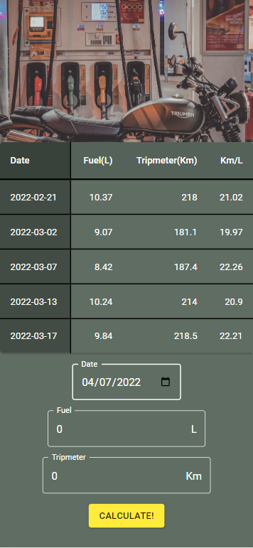

# Guzzler (v1.07)

This App allows the user to track their vehicle's fuel consumption by letting the user input the date they topped up their fuel, the amount of fuel topped up and the mileage travelled. The app will calculate the fuel consumption and display the stats in a data table. Fuel consumption calculation is only accurate if the fuel is always topped up to the same level eg. full tank, until the fuel trigger auto cuts off, fuel level marker.

